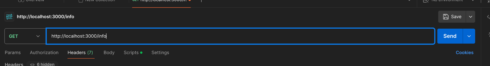
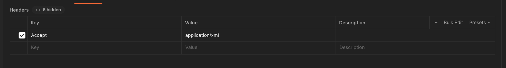

# HTTP - Negociación de Contenido, Caching, Etag :books:
Aplicar los conceptos de negociación de contenido, Etag y control de caché en un servicio RESTful utilizando Node.js y Express.

## Endpoint de Negociación de Contenido 
Dependiendo del tipo de petición que se realice (contenida en el accept del header), el servidor responderá con un tipo de contenido diferente. En este caso las opciones de respuesta son: json, xml y html.
Para ello, nos servimos de un método de apoyo que se encarga de verificar si el accept del header contiene alguno de los formatos anteriormente mencionados. 

Para probar que el endpoint funciona correctamente, dentro de Postman podemos hacer lo siguiente. 

Colocar el URL con el formato http://direccion:puerto/info. Además, tendremos que modificar el header de postman, para que el accept lleve el tipo de petición que se está realizando.

----
Alumno: Tony Villegas Hurtado 
EE: DESARROLLO DE SISTEMAS EN RED