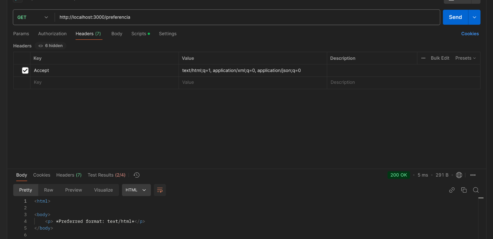

# HTTP - Negociación de Contenido, Caching, Etag :books:
Aplicar los conceptos de negociación de contenido, Etag y control de caché en un servicio RESTful utilizando Node.js y Express.

## Endpoint de Negociación de Contenido **/info**
Dependiendo del tipo de petición que se realice (contenida en el accept del header), el servidor responderá con un tipo de contenido diferente. En este caso las opciones de respuesta son: json, xml y html.
Para ello, nos servimos de un método de apoyo que se encarga de verificar si el accept del header contiene alguno de los formatos anteriormente mencionados. 

Para probar que el endpoint funciona correctamente, dentro de Postman podemos hacer lo siguiente. 

Colocar el URL con el formato http://direccion:puerto/info. Además, tendremos que modificar el header de postman, para que el accept lleve el tipo de petición que se está realizando.

Como vemos, la respuesta la da en el formato solicitado.

## Endpoint con Factores de Calidad **/preferencia**

En este caso, el servidor responderá con el formato que tenga mayor prioridad en el accept del header. En caso de que no se encuentre ninguno de los formatos soportados, se responderá con un error 406.
Para probar que el endpoint funciona correctamente, dentro de Postman podemos hacer lo siguiente.

Dentro del valor del accept en el header, agregaremos los niveles de preferencia (q) a cada uno de los formatos, de modo que el de mayor valor sea el que se responda. Por ejemplo, en la imagen de arriba podemos observar que la respuesta se hizo en JSON. Sin embargo, en la siguiente imagen veremos que se hizo en XML y en la siguiente en html. 

## Endpoint con Control de Caché **/cache**
EL siguiente punto fue el de cache. Para ello, se implementó un endpoint que responde siempre con un mensaje "Respuesta con control de caché".
Eso lo podemos ver en la siguiente consulta en Postman:

## Endpoint con  Etag **/etag**
Finalmente, se implementó un endpoint que responde con un mensaje "Respuesta con Etag". En caso de que el etag no cambie entonces se manda un error 304. Para probar que el endpoint funciona correctamente, dentro de Postman podemos hacer lo siguiente.

Eso sucede para que se optimice el tráfico de red, ya que si el recurso no ha cambiado, no es necesario que se envíe de nuevo. Para ello, tendremos que agregar un clave valor en postman con el If-None-Match y el valor del etag que se obtuvo en la primera consulta.

En caso de que el tag sea diferente, entonces la respuesta será la siguiente:

----
Alumno: Tony Villegas Hurtado  
EE: DESARROLLO DE SISTEMAS EN RED